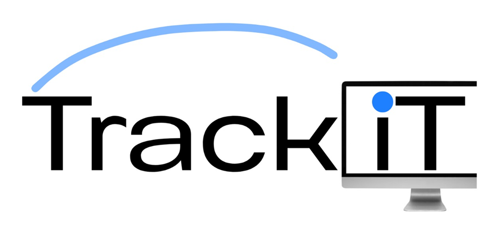

<p align="center">
  
</p>

# TrackiT — Sistema CMDB e inventario tecnológico

TrackiT es una aplicación web desarrollada en PHP y MariaDB para administrar el ciclo de vida completo de los activos tecnológicos de una organización. El sistema centraliza usuarios, inventario, ubicaciones, custodios, asignaciones, devoluciones, reparaciones, solicitudes, licencias de software, depreciación, códigos QR, bajas, reportes y auditoría.

El proyecto fue construido como examen semestral de Desarrollo de Software 7, aplicando arquitectura MVC, programación por interfaces, principios de seguridad OWASP, cifrado y firma digital con OpenSSL, trazabilidad y separación de responsabilidades.

## Tabla de contenido

1. [Objetivo](#objetivo)
2. [Problema que resuelve](#problema-que-resuelve)
3. [Características principales](#características-principales)
4. [Roles y permisos](#roles-y-permisos)
5. [Flujos principales](#flujos-principales)
6. [Tecnologías](#tecnologías)
7. [Arquitectura](#arquitectura)
8. [Estructura del proyecto](#estructura-del-proyecto)
9. [Base de datos](#base-de-datos)
10. [Seguridad](#seguridad)
11. [Criptografía](#criptografía)
12. [Valor residual y depreciación](#valor-residual-y-depreciación)
13. [Instalación](#instalación)
14. [Configuración](#configuración)
15. [Datos demostrativos](#datos-demostrativos)
16. [Acceso desde un celular](#acceso-desde-un-celular)
17. [Uso del sistema](#uso-del-sistema)
18. [Pruebas recomendadas](#pruebas-recomendadas)
19. [Resolución de problemas](#resolución-de-problemas)
20. [Cobertura de requisitos](#cobertura-de-requisitos)
21. [Limitaciones y mejoras futuras](#limitaciones-y-mejoras-futuras)
22. [Enlaces de entrega](#enlaces-de-entrega)
23. [Publicación en la rama principal](#publicación-en-la-rama-principal)

---

## Objetivo

Desarrollar una CMDB capaz de registrar y relacionar los elementos tecnológicos de una organización, garantizando que cada activo pueda ser localizado, consultado, asignado, reparado, depreciado, auditado y dado de baja sin perder su historial.

### Objetivos específicos

- Administrar cuentas y roles con restricciones de acceso.
- Organizar el inventario mediante categorías, subcategorías y productos generales.
- Registrar copias individuales de cada producto.
- Controlar estados, ubicaciones, custodios y movimientos.
- Gestionar asignaciones y devoluciones.
- Permitir solicitudes de equipos, software, licencias y reparaciones.
- Asignar reparaciones a técnicos y conservar su diagnóstico.
- Controlar licencias, puestos y vencimientos.
- Generar reportes operativos, presupuestarios y de depreciación.
- Aplicar seguridad OWASP, hashing, cifrado RSA y firma digital.
- Conservar trazabilidad mediante auditoría y cadenas de hashes.

## Problema que resuelve

Muchas organizaciones administran sus equipos en hojas de cálculo independientes, documentos dispersos o registros manuales. Esto dificulta conocer:

- Cuántos equipos existen.
- Dónde se encuentran.
- Quién tiene cada activo.
- Qué equipos están disponibles, dañados o en reparación.
- Qué licencias están por vencer.
- Cuándo debe renovarse o reemplazarse un equipo.
- Qué acciones realizó cada usuario.

TrackiT reúne esa información en una sola aplicación y permite consultar el historial completo de los activos.

## Características principales

### Autenticación y usuarios

- Inicio de sesión por usuario, correo o cédula.
- Contraseñas almacenadas mediante hash seguro.
- Bloqueo después de tres intentos fallidos.
- Registro de IP, navegador, fecha, éxito y motivo del intento.
- Activación, desactivación y desbloqueo de cuentas.
- Cambio de contraseña desde el perfil.
- Registro automático del primer administrador cuando la base no tiene usuarios.

### Inventario

- CRUD de categorías.
- CRUD de subcategorías.
- CRUD de productos generales.
- Registro de marca, modelo, tipo y vida útil.
- Registro de copias o activos individuales.
- Código de activo y número de serie únicos.
- Dirección IP opcional.
- Costo, valor residual y fechas.
- Estado operativo y ubicación.
- Mínimo de dos imágenes por activo.
- Imagen principal y galería.
- Código QR y ficha pública segura.

### Ubicaciones

- Registro de edificios, oficinas, bodegas, casas y otras ubicaciones.
- Edificio, piso, oficina y dirección.
- Historial de ubicación de los colaboradores.
- Restricción de desactivación cuando la ubicación está en uso.

### Asignaciones y devoluciones

- Asignación de activos disponibles a colaboradores.
- Registro del administrador que entrega.
- Actualización automática del estado a `ASIGNADO`.
- Vista privada “Mis equipos”.
- Registro de devoluciones.
- Condición de recepción y motivo.
- Cambio de estado y ubicación posterior.

### Solicitudes

- Solicitudes de equipo, software, licencia u otra necesidad.
- Justificación, cantidad y prioridad.
- Necesidad inmediata, anual o quinquenal.
- Año y costo presupuestado.
- Revisión administrativa.
- Estados de espera, trámite, aprobación, rechazo, atención y cancelación.

### Reparaciones

- Reporte de fallas desde un equipo asignado.
- Captura de la ubicación del solicitante.
- Asignación de técnico.
- Diagnóstico, trabajo realizado y costo.
- Estados pendiente, en proceso, finalizada, no reparable o cancelada.
- Actualización automática del estado del activo.

### Licencias de software

- Proveedor y tipo de licencia.
- URL de acceso.
- Fecha de inicio y expiración.
- Renovación automática.
- Cantidad de puestos.
- Asignación y revocación de puestos.
- Vista “Mis licencias” para colaboradores.
- Claves cifradas con RSA.
- Confirmación de contraseña antes de revelar una clave.

### Bajas de activos

- Descarte y donación.
- Motivo y opinión técnica.
- Entidad beneficiaria.
- Responsable de la donación.
- Documento de referencia.
- Cambio automático a `DESCARTE` o `DONADO`.
- Conservación del historial sin eliminación física.

### Reportes

- Resumen general del inventario.
- Inventario dinámico con filtros.
- Exportación compatible con Excel.
- Activos próximos al fin de vida útil.
- Presupuesto de necesidades.
- Historial de movimientos.
- Historial de accesos.
- Auditoría y verificación de integridad.

## Roles y permisos

### Administrador

Tiene acceso completo al sistema:

- Usuarios.
- Categorías, subcategorías, productos y activos.
- Ubicaciones.
- Asignaciones y devoluciones.
- Solicitudes y reparaciones.
- Licencias.
- Bajas.
- Reportes y auditoría.

### Técnico

- Consulta el inventario técnico.
- Visualiza reparaciones asignadas.
- Consulta la ubicación del solicitante.
- Registra diagnóstico, trabajo y costo.
- Actualiza el estado de la reparación.
- Edita su perfil y contraseña.

### Colaborador

- Consulta sus equipos asignados.
- Reporta fallas.
- Registra solicitudes.
- Consulta el seguimiento de sus solicitudes.
- Consulta sus licencias.
- Edita su información y ubicación.
- Cambia su contraseña.

## Flujos principales

### Registro de un activo

```text
Categoría
  → Subcategoría
    → Producto general
      → Copia individual
        → Imágenes
          → QR y ficha
```

Ejemplo:

```text
Equipo de Cómputo
  → Laptop
    → HP ProBook 450 G10
      → TRK-LAP-001
```

### Asignación

```text
Activo disponible
  → Seleccionar colaborador
    → Seleccionar ubicación
      → Registrar entrega
        → Estado ASIGNADO
```

### Reparación

```text
Colaborador reporta falla
  → Administrador revisa
    → Asigna técnico
      → Técnico diagnostica
        → Finaliza o marca no reparable
```

### Baja

```text
Activo sin asignación activa
  → Evaluación
    → Descarte o donación
      → Movimiento y auditoría
```

## Tecnologías

- PHP 8.2 o superior.
- MariaDB 10.4+ o MySQL 8+.
- Apache 2.4 con `mod_rewrite`.
- HTML5.
- CSS3 responsivo.
- JavaScript sin framework.
- PDO con consultas preparadas.
- OpenSSL.
- QuickChart para generar códigos QR.
- Git y GitHub.

### Extensiones PHP necesarias

- `pdo_mysql`
- `openssl`
- `fileinfo`
- `mbstring`
- `curl` o `allow_url_fopen` para QR

## Arquitectura

El proyecto utiliza una arquitectura MVC ampliada con repositorios, servicios e interfaces.

```text
Solicitud HTTP
    ↓
Router
    ↓
Controller
    ↓
Service
    ↓
Repository / Interface
    ↓
PDO / MariaDB
    ↓
View
```

### Responsabilidades

- **Controllers:** reciben solicitudes y coordinan respuestas.
- **Services:** contienen reglas del negocio y transacciones.
- **Repositories:** ejecutan consultas SQL.
- **Interfaces:** definen contratos y reducen acoplamiento.
- **Core:** router, sesión, autenticación, CSRF, errores y seguridad.
- **Views:** interfaz del usuario.
- **Helpers:** funciones comunes.

## Estructura del proyecto

```text
Semestral/
├── app/
│   ├── Controllers/
│   ├── Core/
│   ├── Helpers/
│   ├── Interfaces/
│   ├── Repositories/
│   ├── Services/
│   └── Views/
├── config/
│   ├── app.php
│   ├── database.example.php
│   ├── crypto.example.php
│   └── session.php
├── database/
│   ├── inventario.sql
│   ├── datos_demo.sql
│   └── migrations/
├── public/
│   ├── assets/
│   ├── uploads/
│   ├── .htaccess
│   └── index.php
├── routes/
│   └── web.php
├── scripts/
│   ├── generate_keys.php
│   └── test_crypto.php
├── storage/
│   ├── keys/
│   ├── logs/
│   └── qrcodes/
├── bootstrap.php
├── .gitignore
└── README.md
```

## Base de datos

La base se llama `Inventario` y utiliza relaciones con claves foráneas.

### Entidades principales

- `Rol`
- `Usuario`
- `Historial_Login`
- `LlavePublicaUsuario`
- `Auditoria`
- `Colaborador`
- `Ubicacion`
- `ColaboradorUbicacion`
- `Categoria`
- `Subcategoria`
- `Producto`
- `Activo`
- `ImagenActivo`
- `EstadoActivo`
- `MovimientoActivo`
- `AsignacionActivo`
- `DevolucionActivo`
- `SolicitudNecesidad`
- `SolicitudReparacion`
- `Reparacion`
- `LicenciaSoftware`
- `AsignacionLicencia`
- `TipoBaja`
- `BajaActivo`

### Vistas

- `VistaInventarioDetalle`
- `VistaResumenCategoria`
- `VistaAsignacionesActivas`
- `VistaActivosPorColaborador`
- `VistaActivosProximosDepreciacion`
- `VistaActivosConImagenesIncompletas`

## Seguridad

El sistema incorpora controles relacionados con OWASP:

### A01 — Control de acceso

- Roles y permisos.
- Verificación en controladores y servicios.
- Acceso restringido a rutas administrativas.

### A02 — Fallos criptográficos

- Hash de contraseñas con `password_hash`.
- Verificación mediante `password_verify`.
- RSA para firmas y cifrado de claves.
- Llaves privadas fuera del repositorio.

### A03 — Inyección

- PDO y consultas preparadas.
- Parámetros enlazados.
- No se concatenan entradas del usuario directamente en SQL.

### A05 — Configuración insegura

- Configuraciones privadas separadas.
- `.gitignore` para claves, contraseñas y logs.
- Mensajes de error amigables.
- Modo debug configurable.

### A07 — Identificación y autenticación

- Tres intentos fallidos.
- Bloqueo de cuenta.
- Regeneración de sesión.
- Cookies seguras.
- Registro de accesos.

### A08 — Integridad

- Bitácora encadenada mediante SHA-256.
- Firma digital RSA.
- Verificación de la cadena de auditoría.

### Otras medidas

- Token CSRF en formularios POST.
- Escape HTML mediante `e()`.
- Encabezados CSP y de seguridad.
- Validación de MIME y tamaño en imágenes.
- Control global de errores.
- Prevención de listado de directorios.

## Criptografía

### Hash de contraseñas

Las contraseñas nunca se almacenan en texto plano.

### Firma digital

La auditoría puede firmar registros con RSA y SHA-256 para detectar alteraciones.

### Cifrado reversible

Las claves de licencias se cifran mediante RSA-OAEP. Para mostrarlas se requiere la contraseña del administrador y la llave privada local.

### Archivos privados

Nunca deben subirse a GitHub:

```text
config/database.php
config/crypto.php
storage/keys/private.pem
storage/keys/public.pem
storage/logs/*
```

## Valor residual y depreciación

El **valor residual** es el valor estimado que tendrá un activo cuando termine su vida útil. No representa su precio actual.

Ejemplo:

```text
Costo de compra: B/. 1,000.00
Vida útil: 60 meses
Valor residual: B/. 100.00
```

En este ejemplo se estima que, después de cinco años, el equipo todavía podría venderse, reutilizarse o recuperarse por B/. 100.00.

Para licencias o software normalmente puede utilizarse:

```text
Valor residual: B/. 0.00
```

El valor residual pertenece a la **copia individual o activo**, no al producto general, porque dos copias del mismo modelo pueden tener costos, fechas y condiciones diferentes.

## Instalación

### Requisitos previos

1. Instalar XAMPP.
2. Iniciar Apache y MySQL.
3. Tener PHP 8.2 o superior.
4. Habilitar OpenSSL y PDO MySQL.

### Clonar el repositorio

```powershell
git clone https://github.com/LI-ZETH/Semestral.git
cd Semestral
```

Colocar el proyecto en una ruta como:

```text
C:\xampp\htdocs\Desarrollo_7\Semestral
```

### Base de datos

1. Abrir `http://localhost/phpmyadmin`.
2. Importar `database/inventario.sql`.
3. Si el script principal todavía no contiene `SolicitudReparacion` o `AsignacionLicencia`, ejecutar las migraciones correspondientes.
4. No ejecutar nuevamente la migración de imagen de categoría si las columnas `imagenAjuste` e `imagenTamano` ya existen.

Antes de la entrega final se recomienda exportar otra vez la base actualizada y reemplazar `database/inventario.sql`. Después de hacerlo, una instalación nueva solo necesitará importar ese archivo.

## Configuración

### Base de datos

Copiar:

```text
config/database.example.php
```

como:

```text
config/database.php
```

Ejemplo:

```php
<?php

declare(strict_types=1);

return [
    'host' => '127.0.0.1',
    'port' => '3306',
    'database' => 'Inventario',
    'username' => 'root',
    'password' => '',
    'charset' => 'utf8mb4',
];
```

### Criptografía

Copiar:

```text
config/crypto.example.php
```

como:

```text
config/crypto.php
```

Cambiar la frase secreta y verificar la ruta de OpenSSL.

Generar llaves:

```powershell
php scripts\generate_keys.php
```

Probar la criptografía:

```powershell
php scripts\test_crypto.php
```

### URL del sistema

```text
http://localhost/Desarrollo_7/Semestral/public
```

## Datos demostrativos

El archivo:

```text
database/datos_demo.sql
```

agrega información de ejemplo sin borrar los registros existentes:

- Tres usuarios demostrativos.
- Un colaborador.
- Seis ubicaciones.
- Dieciocho productos.
- Veintitrés activos.
- Dos imágenes por activo.
- Una asignación activa.
- Una reparación en proceso.
- Tres licencias.
- Solicitudes para reportes presupuestarios.
- Un descarte y una donación.

### Credenciales demostrativas

| Rol | Usuario | Contraseña |
|---|---|---|
| Administrador | `demo_admin` | `TrackIT2026!` |
| Técnico | `demo_tecnico` | `TrackIT2026!` |
| Colaborador | `demo_colaborador` | `TrackIT2026!` |

Importar desde phpMyAdmin después de tener la estructura completa.

El script es idempotente para los datos identificados por códigos, nombres y usuarios; aun así, se recomienda hacer una copia de seguridad antes de ejecutarlo.

## Acceso desde un celular

La computadora y el teléfono deben estar en la misma red Wi-Fi.

### Conocer la IPv4

```powershell
ipconfig
```

Buscar una dirección parecida a:

```text
192.168.1.25
```

Abrir en el teléfono:

```text
http://192.168.1.25/Desarrollo_7/Semestral/public
```

No utilizar `localhost` desde el teléfono, porque apuntaría al propio dispositivo.

Para que un QR funcione desde el celular, debe generarse mientras la aplicación está abierta mediante la IPv4 y no mediante `localhost`.

## Uso del sistema

### Administrador

1. Iniciar sesión.
2. Crear usuarios.
3. Registrar ubicaciones.
4. Crear categorías y subcategorías.
5. Registrar productos.
6. Registrar copias con imágenes.
7. Asignar activos.
8. Revisar solicitudes.
9. Asignar reparaciones.
10. Administrar licencias.
11. Registrar bajas.
12. Consultar reportes y auditoría.

### Técnico

1. Iniciar sesión.
2. Abrir Reparaciones.
3. Consultar falla y ubicación.
4. Registrar diagnóstico.
5. Cambiar a En proceso.
6. Registrar trabajo y costo.
7. Finalizar la reparación.

### Colaborador

1. Iniciar sesión.
2. Consultar Mis equipos.
3. Reportar una reparación.
4. Crear solicitudes.
5. Consultar Mis licencias.
6. Actualizar perfil y ubicación.

## Pruebas recomendadas

### Autenticación

- Usuario correcto.
- Usuario inexistente.
- Contraseña incorrecta.
- Tres intentos y bloqueo.
- Desbloqueo administrativo.

### Inventario

- Producto duplicado.
- Código de activo duplicado.
- Serie duplicada.
- IP inválida.
- Menos de dos imágenes.
- Reemplazo de imagen principal.
- QR y ficha pública.

### Asignaciones

- Asignar un activo disponible.
- Intentar asignarlo dos veces.
- Consultarlo como colaborador.
- Devolverlo.

### Reparaciones

- Reportar falla.
- Asignar técnico.
- Pasar a En proceso.
- Finalizar.

### Licencias

- Registrar licencia.
- Asignar puestos.
- Superar cantidad disponible.
- Revocar un puesto.
- Consultar expiración.

### Bajas

- Intentar dar de baja un activo asignado.
- Registrar descarte.
- Registrar donación.
- Confirmar que ya no sea asignable.

### Seguridad

- Enviar formulario sin CSRF.
- Acceder a una ruta administrativa con otro rol.
- Intentar cargar un archivo no permitido.
- Revisar auditoría y cadena de hashes.

## Resolución de problemas

### Error de conexión

Revisar:

```text
config/database.php
```

Confirmar que MySQL esté iniciado.

### Error 404 en todas las rutas

- Activar `mod_rewrite`.
- Permitir `AllowOverride All` en Apache.
- Verificar `public/.htaccess`.

### OpenSSL no genera llaves

Habilitar en `php.ini`:

```ini
extension=openssl
```

Verificar `openssl_config_path` en `config/crypto.php`.

### QR no disponible

Habilitar:

```ini
extension=curl
```

Reiniciar Apache.

### Las imágenes no aparecen

- Confirmar que las rutas existan dentro de `public`.
- Revisar permisos de `public/uploads`.
- Para los datos demo, copiar `public/assets/img/demo`.

### El celular no abre la aplicación

- Usar IPv4, no `localhost`.
- Conectar ambos dispositivos a la misma red.
- Permitir Apache en el Firewall de Windows.

## Cobertura de requisitos

El proyecto implementa:

- Autenticación, roles, bloqueo y bitácora de acceso.
- MVC, interfaces, servicios y repositorios.
- CRUD de usuarios.
- Categorías, subcategorías, productos y copias.
- Dos o más imágenes por activo.
- QR y ficha.
- Ubicaciones, custodios, asignación y devolución.
- Solicitudes inmediatas, anuales y quinquenales.
- Reparaciones.
- Licencias y puestos.
- Depreciación.
- Reportes y exportación.
- Descarte y donación.
- Auditoría con SHA-256 y RSA.
- Protección CSRF y consultas preparadas.
- Interfaz adaptable a computadora y celular.

## Limitaciones y mejoras futuras

- La columna `foto` del colaborador existe, pero la carga de fotografía no se implementó en la interfaz final. Es opcional y puede permanecer en `NULL`.
- El QR utiliza un proveedor externo para la primera generación.
- Las imágenes cargadas no deben almacenarse directamente en Git en un entorno real.
- Una implementación productiva debe utilizar HTTPS.
- Se pueden agregar notificaciones por correo para vencimientos y reparaciones.
- Se puede incorporar autenticación multifactor.
- Se pueden crear pruebas automatizadas y despliegue continuo.

## Enlaces de entrega

- Repositorio: `https://github.com/LI-ZETH/Semestral`
- Rama final: `main`
- Video explicativo: `https://utpac-my.sharepoint.com/:v:/g/personal/guillermo_mas_utp_ac_pa/IQAImj6eqXqJSLNtQWDK6fl9AQ-mhfaYE1hg10OnHuD8TeE?nav=eyJyZWZlcnJhbEluZm8iOnsicmVmZXJyYWxBcHAiOiJPbmVEcml2ZUZvckJ1c2luZXNzIiwicmVmZXJyYWxBcHBQbGF0Zm9ybSI6IldlYiIsInJlZmVycmFsTW9kZSI6InZpZXciLCJyZWZlcnJhbFZpZXciOiJNeUZpbGVzTGlua0NvcHkifX0&e=OoYr4R`

## Publicación en la rama principal

Antes de fusionar, confirmar que todo funciona en `reconstruccion-cmdb`.

```powershell
git status
git add -A
git commit -m "docs: completar README y datos demostrativos"
git push origin reconstruccion-cmdb
```

Cambiar a `main`:

```powershell
git checkout main
git pull origin main
git merge --no-ff reconstruccion-cmdb -m "merge: integrar version final de TrackiT"
git push origin main
```

Comprobar:

```powershell
git status
git log --oneline --decorate -10
```

No eliminar la rama de trabajo hasta confirmar que la versión de `main` abre correctamente.

---

## Licencia académica

Proyecto desarrollado con fines educativos. Los nombres de marcas y productos utilizados en los datos demostrativos pertenecen a sus respectivos propietarios y se incluyen únicamente como ejemplos de inventario.

## Alumnos

Genesis Luo, Guillermo Mas, Winston Franco y Joseph Córdoba.
